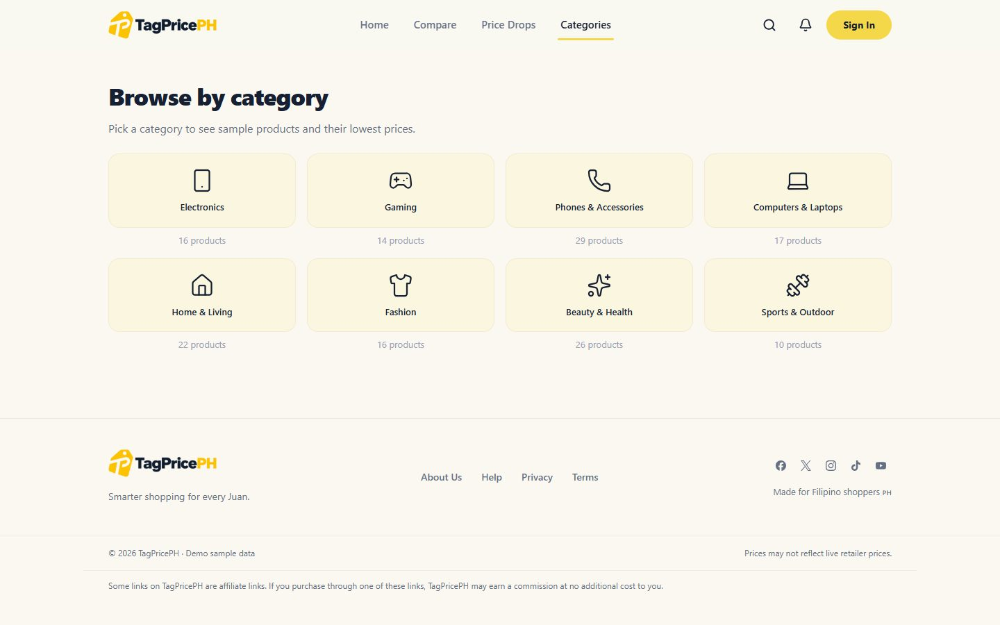
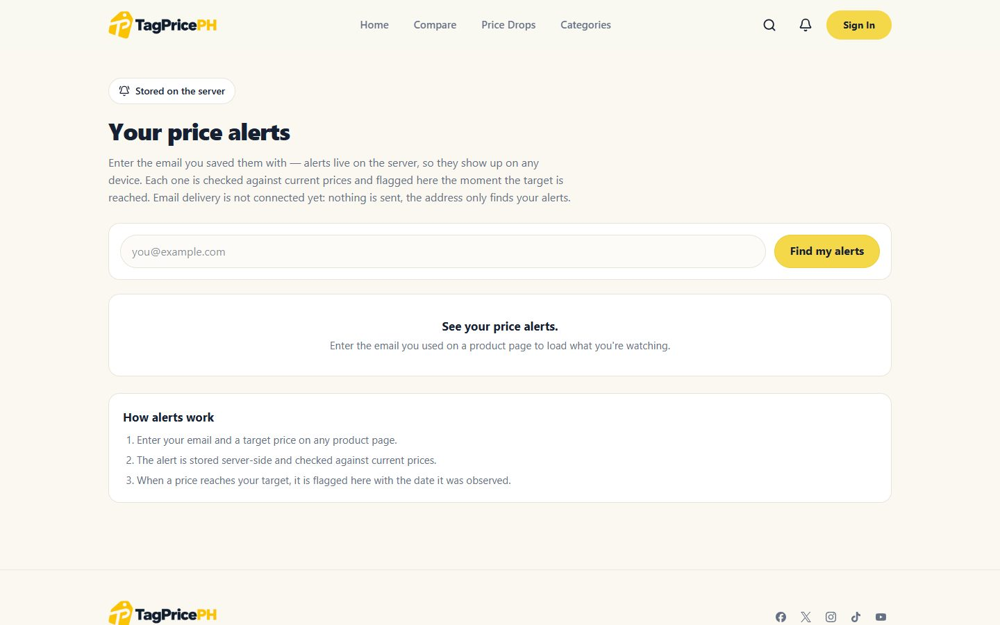

# TagPricePH

[](https://tagpriceph.vercel.app)
[](LICENSE)

A price comparison and tracking site for the Philippines — compare a product
across Shopee, Lazada and TikTok Shop, see how its price moved, and get told
when it drops. Built with Next.js App Router, React 19, TypeScript and
PostgreSQL.

**[Live site](https://tagpriceph.vercel.app)**


The deployment above runs the **demo catalog**. The marketplace adapters are
registered but refuse to serve rows until an authorized data source is
configured — the app fails closed rather than passing sample data off as live
retailer prices.

## A look around

These are screenshots of the running site, not mockups.

| Product page                                                                | Price drops                                                             |
| --------------------------------------------------------------------------- | ----------------------------------------------------------------------- |
|  |  |
| <sub><b>Product</b> — lowest listed price, fair-price verdict, savings, alert signup</sub> | <sub><b>Price drops</b> — items below their previous listed price</sub> |
| Categories                                                                   | Alerts                                                                  |
|                                |                  |
| <sub><b>Categories</b> — browse the catalog by segment</sub>                 | <sub><b>Alerts</b> — server-stored watches, looked up by email</sub>    |

## Quick start

```bash
npm install
npm run dev          # http://localhost:3000
```

```bash
npm run db:migrate   # apply schema migrations
npm run catalog:seed # load the demo catalog
```

```bash
npm run build && npm start   # production
```

| Command                  | What it does                                              |
| ------------------------ | --------------------------------------------------------- |
| `npm run typecheck`      | `tsc --noEmit`                                            |
| `npm run lint`           | ESLint (flat config)                                      |
| `npm run verify`         | typecheck, lint, build, then all 21 verification suites    |
| `npm run verify:full`    | `verify` plus the recorded-history suite                  |
| `npm run db:migrate`     | Apply migrations under `db/migrations/`                   |
| `npm run db:status`      | Show which migrations are applied                         |
| `npm run db:verify`      | Check schema against the migrations                       |
| `npm run catalog:seed`   | Seed the demo catalog                                     |

## Configuration

Copy `.env.example` to `.env.local`. Only variable names are listed here — no
values live in this repository.

| Variable                  | Purpose                                                                 |
| ------------------------- | ----------------------------------------------------------------------- |
| `POSTGRES_URL`            | Pooled connection used by the app (`-pooler` endpoint on Neon)          |
| `DATABASE_URL_UNPOOLED`   | Direct connection for migrations and verification scripts               |
| `NEXT_PUBLIC_DEMO_MODE`   | `true` serves the demo catalog; UI banners read each offer's stored source |
| `DATA_PROVIDER`           | Provider id for reads when demo mode is off; unset or `demo` fails closed |
| `ADMIN_TOKEN`             | Gates `/admin`. Unset, the route answers 503                            |
| `INGEST_SECRET`           | Gates `/api/ingest`. Unset, the endpoint answers 404                    |
| `CRON_SECRET`             | Bearer token for `/api/alerts/check`. Unset, answers 503                |
| `SITE_URL`                | Canonical origin behind canonical tags, `og:url`, sitemap and JSON-LD   |

Secrets must never be prefixed `NEXT_PUBLIC_` or referenced from client code.

## Architecture

Every stage is a small module with a script-testable core, and no stage trusts
the one before it silently.

```
Provider  ->  Normalizer  ->  Matcher  ->  Database  ->  Offers  ->  Observations
                                                                             |
Frontend  ->  API  ->  Price intelligence  -----------------------------------
```

**Providers** implement one contract — list, search, get — and are registered in
`lib/api/registry.ts`: `demo`, `db`, `shopee`, `lazada`, `tiktok-shop`.
Selection is fail-closed: demo mode off with no `DATA_PROVIDER` is an error, not
a silent fallback to sample data.

**Normalizing** happens in `lib/data/ingest.ts` — raw provider output becomes
`Product` rows with prices in integer centavos, an availability enum, a store id
and a URL. A provider may never invent readings, and the database read model may
never be treated as a source of new ones.

**Matching** (`lib/matching/`) answers with a three-way contract — `match`,
`ambiguous`, `refuse` — preferring an exact SKU over fuzzy text, honoring stated
storage and colour variants, and refusing when nothing clears the bar. Typo
tolerance lives in search, not in the matcher.

**The schema** is 14 migrations under `db/migrations/`, all reached through
parameterised SQL in `lib/db/*-queries.ts`.

## Verification

`npm run verify` chains typecheck, lint, a production build, then 21 suites that
each exercise one concern: trust, db, data, match, backend, typo, observations,
ingest, views, alerts, admin, catalog, security, hardening, readiness,
freshness, providers, perf, mobile, recorded history and polish.

They are plain Node scripts under `scripts/` — no test framework, no browser
download. Each prints what it checked and exits non-zero on the first failure,
so `verify` is safe to gate a deploy on.

## Pages

| Route                              | What it is                                              |
| ---------------------------------- | ------------------------------------------------------- |
| `/`                                | Search, featured deal, price drops and categories      |
| `/search`                          | Full-text search with typo tolerance                    |
| `/categories`, `/categories/[slug]`| Browse and drill into the catalog                       |
| `/product/[slug]`                  | Price history, fair-price verdict, per-offer comparison |
| `/price-drops`                     | Products under their previous listed price              |
| `/alerts`                          | Look up server-stored price alerts by email             |
| `/admin`                           | Token-gated console                                     |
| `/go/[store]/[product]`            | Affiliate redirect with click tracking                  |

API routes cover `health`, `search`, `suggestions`, `views`, `alerts`,
`alerts/check` (driven by the daily cron in `vercel.json`), `ingest` and the
admin session.

## Stack

| Layer      | Choice                                          |
| ---------- | ----------------------------------------------- |
| Framework  | Next.js 16 (App Router, Turbopack)              |
| UI         | React 19, Tailwind CSS v4                       |
| Language   | TypeScript (strict)                             |
| Database   | PostgreSQL (Neon) via `pg`                      |
| Icons      | lucide-react                                    |
| Analytics  | Vercel Analytics (first-party, no third-party)  |

## Docs

- [`BACKEND_ARCHITECTURE.md`](BACKEND_ARCHITECTURE.md) — how a price reaches the screen, stage by stage
- [`AFFILIATE_INTEGRATION.md`](AFFILIATE_INTEGRATION.md) — store links and click tracking
- [`BACKEND_STATUS.md`](BACKEND_STATUS.md) / [`BACKEND_FIX_STATUS.md`](BACKEND_FIX_STATUS.md) — what is done and what is left

## License

MIT
